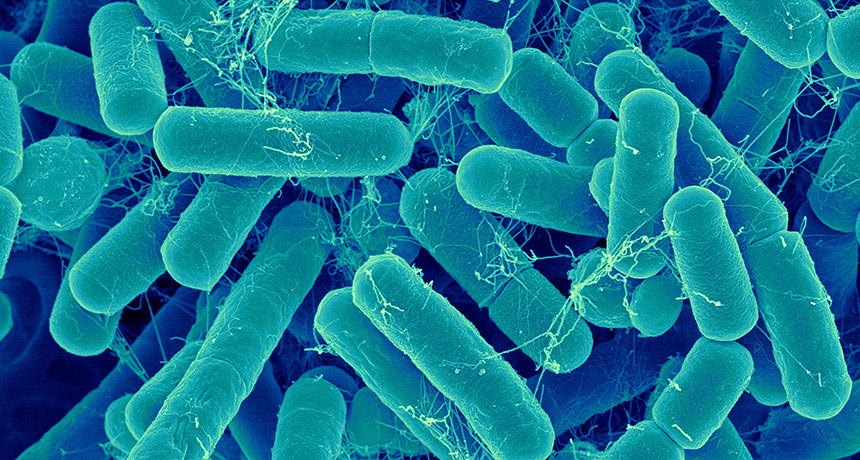

# Plotly & Belly Button Diversity

## Project Overview

## Resources
- **Data Sources**: `samples.json` file
- **Software and Tools**: JavaScript, HTML/CSS, Bootstrap, VS Code & Git Bash

## Challenge Deliverables and Results

### Deliverable 1: Create the `buildCharts` function and Bar Chart

When the `charts.js` file runs, the bar chart is added to the dashboard:

### Deliverable 2: Create the Bubble Chart

When the `charts.js` file runs, the bubble chart is added to the dashboard:

### Deliverable 3: Create the Gauge Chart

When the `charts.js` file runs, the gauge chart is added to the dashboard:

### Deliverable 4: Customize the Dashboard
I made several customizations to the webpage:
- I added an image to the jumbotron.
- I added a background color to the dashboard and customized compatible colors for the charts.
- I made changes to the header font to make it more noticeable and visually appealing.
- I added more information about the project as a paragraph on the page.

When the dashboard is first opened in a browser, ID 940's data is displayed with all 3 charts. Then, when a user selects a sample, the dashboard displays the new data in the panel and all three charts are updated. 

The dashboard looks like this:

